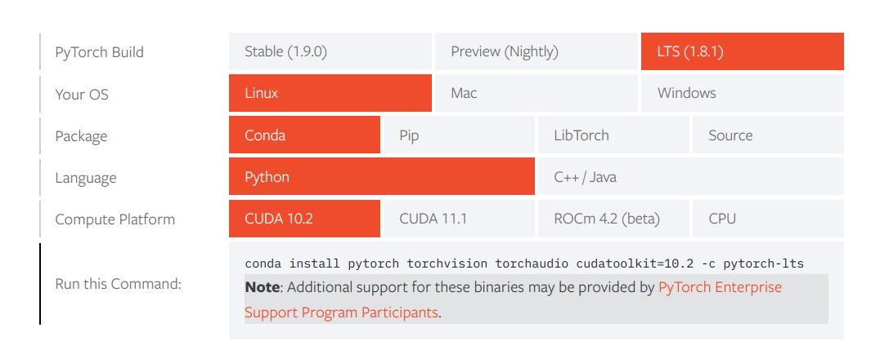

.. _install:

Installation
******************

This page guides you through the installation process to get up and running with DRLoco. It should take about an hour, but might also get tricky depending on your system and require some googling to solve unexpected issues. So be prepared and best luck!

.. warning::

   This repository was developed and tested on Ubuntu 16.04 and Ubuntu 18.04 using Python 3.7. The installation instructions are the same for both Ubuntu versions and should also apply to newer Ubuntu versions.

#. Install Anaconda following the `official installation guide <https://docs.anaconda.com/anaconda/install/linux/#installation>`_.

	#. *Anaconda*, or *conda* for short. is a data science toolkit (and package manager) that allows you to easily install open-source python packages and organize them in separate environments.

#. Create a new conda environment with Python 3.7 (you can change the environment name *drloco* to evry other name you like)

	.. code-block:: console

	   conda create -n drloco python=3.7

#. Activate the new envrionment	   

	.. code-block:: console

	   source activate drloco

#. Install *PyTorch* using the `official installation guide <https://pytorch.org/get-started/locally/>`_ choosing the following options:

#. Install MuJoCo and mujoco-py following `these instructions <https://github.com/openai/mujoco-py#install-mujoco>`_.

#. Install Stable-Baselines 3 with the command below

	.. code-block:: console

	   pip install stable-baselines3[extra]

	#. If sth. goes wrong, remove the '[extra]'. This will leave out multiple packages, that you will need to install later separately, e.g. *tensorboard*.

#. Clone this repository (link: https://github.com/rgalljamov/DRLoco)

#. Install the gym_mimic_envs (will be improved in the future)

	1. Open a terminal and navigate to the mujoco folder, where 'gym_mimic_envs' folder is located. 
	2. `pip install -e .` to install the environment

	    1. If you get the error "ERROR: Package 'imageio' requires a different Python: 2.7.17 not in '>=3.5'", use `pip3 install -e .` instead. 
	    
    3. NOTE: It is important to not use `sudo` during installation.

#. **TODO: we can automate this step by just getting the current directory and appending it to sys.path!** Change `sys.path.append('/home/rustam/code/torch/')` in 'scripts/common/config.py' to reflect the path to the main folder where the code is stored 'path/to/folder_with_scripts_folder/'

#. Change `assets_path` in 'ref_trajecs.py'.

#. Change `is_remote()` in 'scripts/common/utils.py'

#. Execute``scripts/run.py`` to see if there are any other packages missing in your environment and install them, too. If everything went well, you should see a MuJoCo model walking in circles. Once, the simulation appears, press [Space] to start the simulation.

#. To record videos of the generated walking gait at the training's end, we need to further install ``ffmpeg``: ``conda install -c conda-forge ffmpeg``

	1. If you want to record the video on a remote server without a UI, in addtion install
		1. `sudo apt install xvfb`
		2. to execute the training script run `xvfb-run python /path/to/script.py`
		3. if the first two steps still not allow to record videos, use
			1. install `conda install -c conda-forge pyvirtualdisplay`

#. Install Weights&Biases for logging training results

	1. `conda install -c conda-forge wandb`